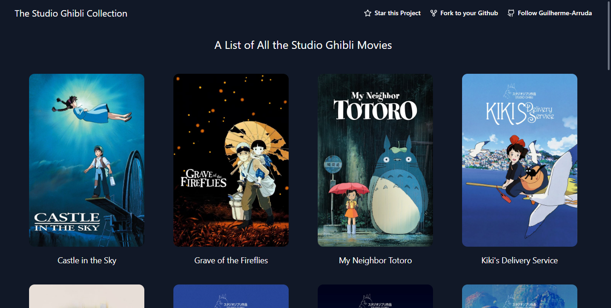
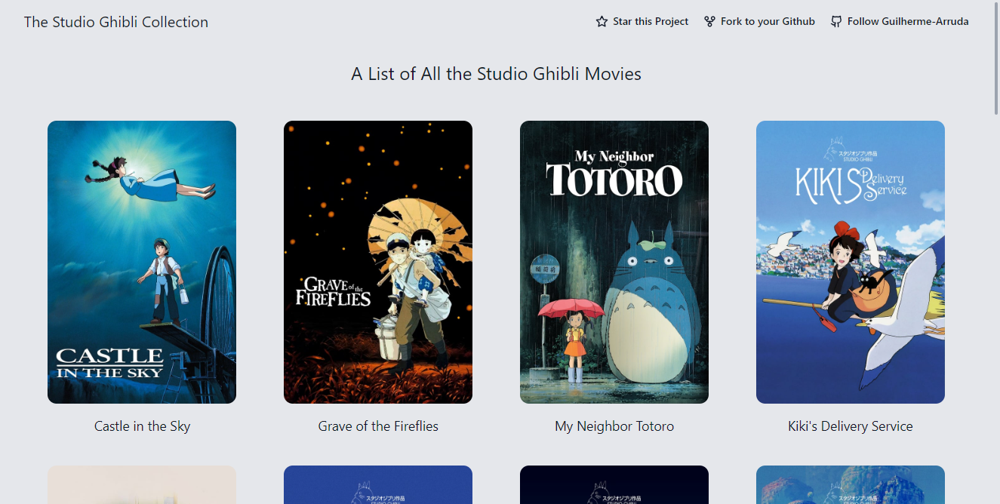
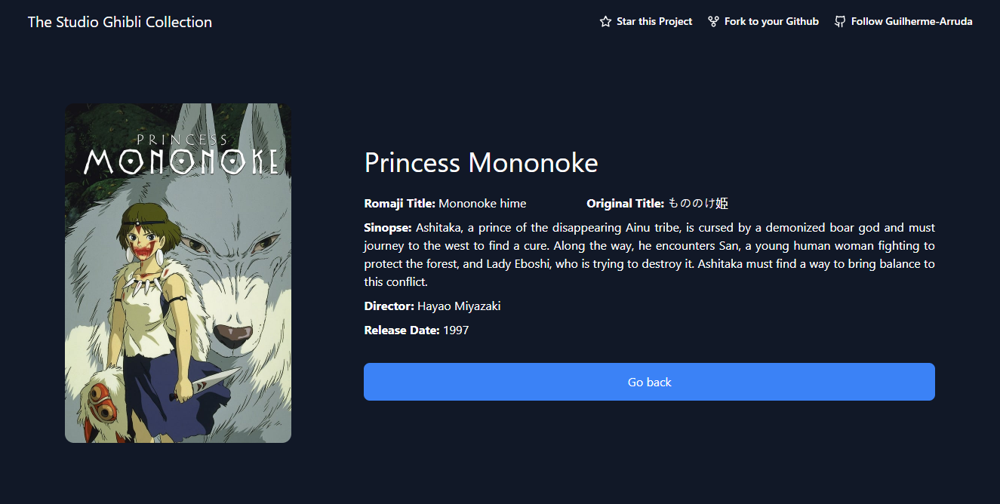
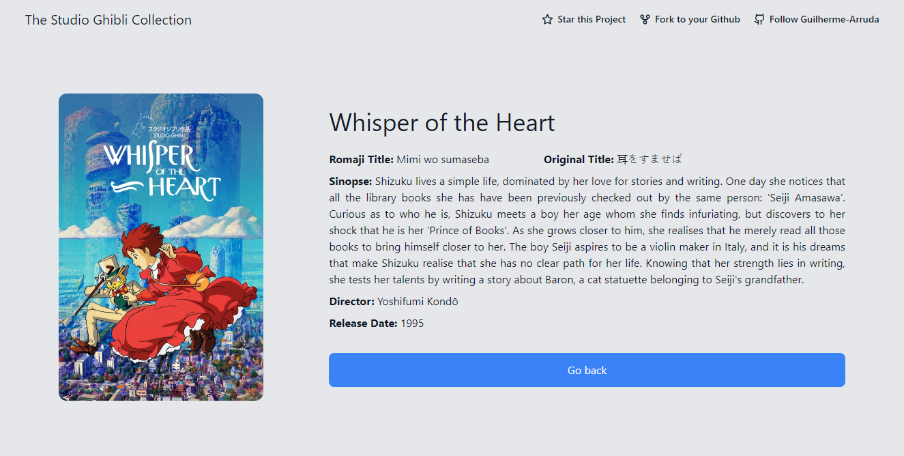
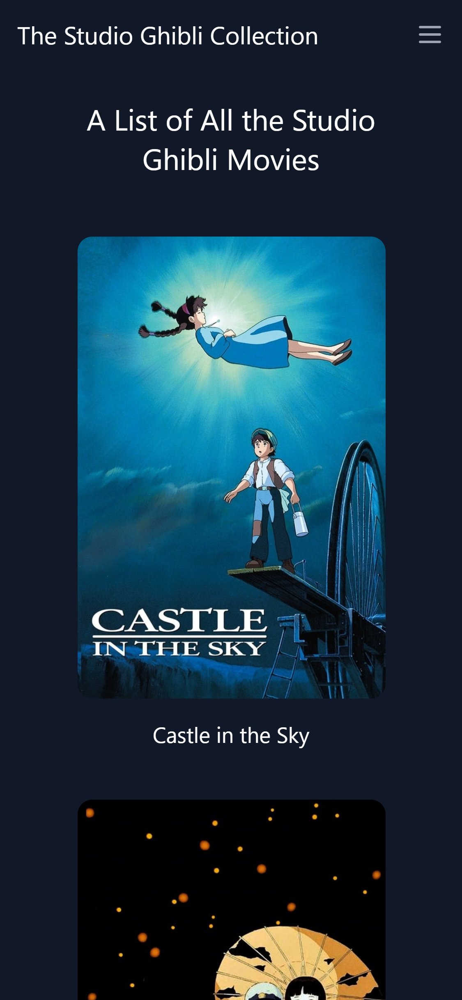
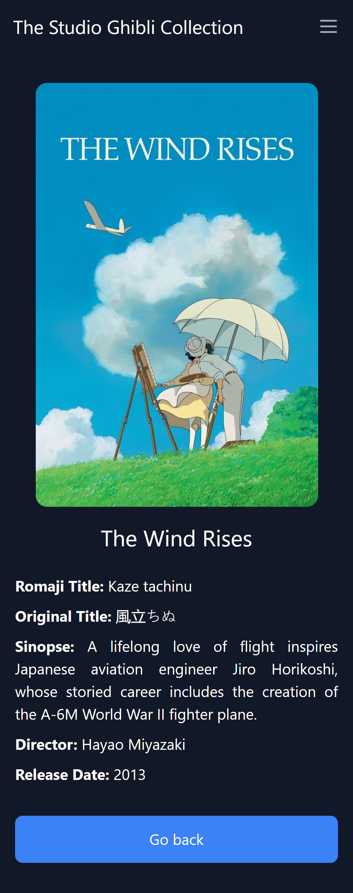
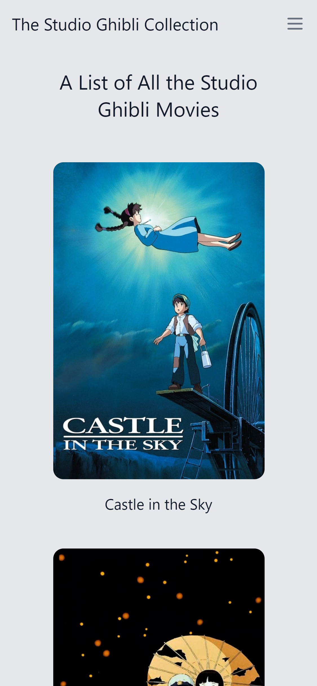
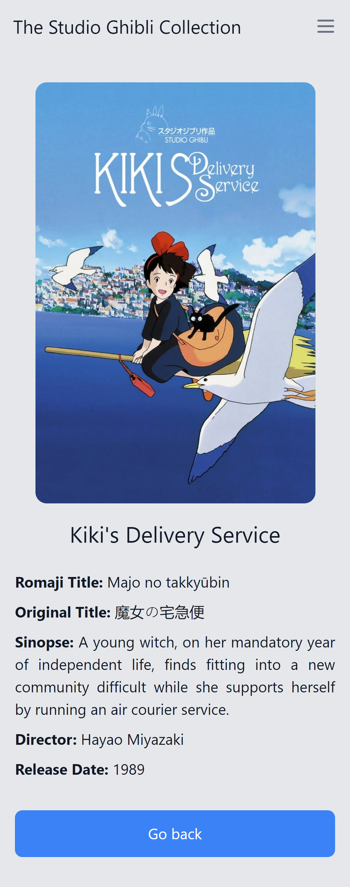

# Studio Ghibli

A web page that shows all Studio Ghibli Movies. <br>
You can also view details from a movie when you click on it.

## Web Version

<p width='100%' align='center'> 
  
  
</p>
<p width='100%' align='center'> 
  
  
</p>

## Mobile Version

<p width='100%' align='center'> 
  
  
  
  
</p>

## Technologies

* Vite
* Tailwind CSS
* React Router DOM
* ESLint
* Prettier

## 🤖 Demo

You can view the project demo at [https://studio-ghibli-guilherme-arruda.vercel.app](https://studio-ghibli-guilherme-arruda.vercel.app).

## 🚀 Getting Started

To run the project in your machine you can clone this repository locally in a directory of your choice using:

```
git clone https://github.com/Guilherme-Arruda/Studio-Ghibli.git
```

After cloning you need to install all dependencies using:

```bash
npm install
# or
yarn
```

Then you can finally run the project using:

```bash
npm run dev
# or
yarn dev
```

## 📄 License

This project is under MIT license - see the file [LICENSE.md](https://github.com/Guilherme-Arruda/Studio-Ghibli/blob/master/LICENSE) for details.

---

##### Coded with love by Guilherme Arruda ♥️
